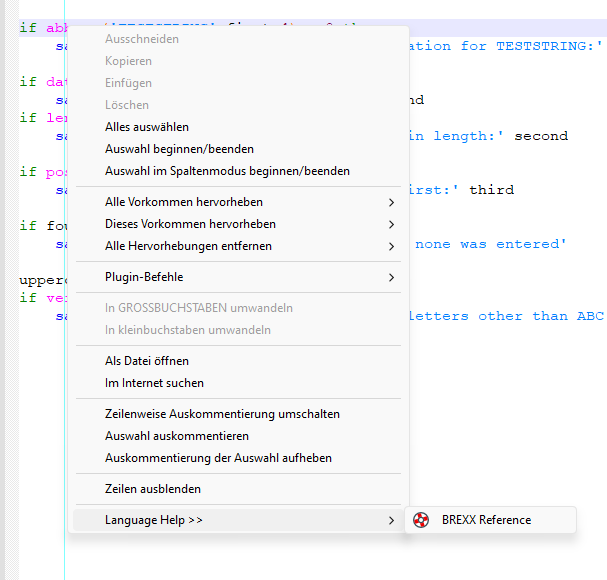

# brexx-reference
I compiled the online available BREXX Reference by Vassilis Vlachoudis to a CHM File. Using the Languagehelp Plugin in Notepad++ this enables looking up REXX commands in an easy way.



``

                                                            o o
                                                             ____oo_
                                                            /||    |\
                                                             ||    |
                                                             `.___.'
                                                             MARMITA

               **********
                ***    ***
                 **     ***
                **      ***
                **      **      ****    ***    ***   ***    ***
                **     **      **  **     **  ** *     **  ** *
               *********      **   **     ** **        ** **
               **  ***       **   **       ***          ***
               **   **      *******        **           **
              **     **     **            ****         ****
              **      **    **           ** **  *     ** **  *
             ***      ***   **   **   * **   ***   * **   ***
            ****     ******  *****    ***     **   ***     **

                 Restructured    EXtended      eXecutor

                           Version 2.1

Vassilis N. Vlachoudis
Vasilis.Vlachoudis@cern.ch
```
